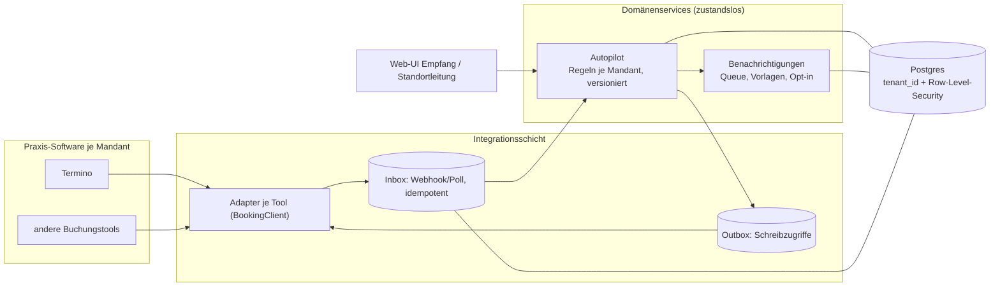

# Architektur: 100+ Praxen, mandantenfähig

Der Prototyp (siehe [README](README.md)) ist bewusst ein Monolith mit klaren Nähten. Das Zielbild für 100+ Praxen baut auf denselben Nähten auf.

## Eckpfeiler

1. **Mandantenmodell.** Eine gemeinsame Datenbank mit `tenant_id` in jeder Tabelle und Postgres Row-Level-Security (Mandant wird pro Verbindung gesetzt). Das ist günstig zu betreiben und einfach zu migrieren. Große Partner bekommen bei Bedarf eine eigene Datenbank (Silo) hinter derselben Schnittstelle. Jeder Mandant hat Standorte, Rollen pro Standort und eigene Konfiguration.
2. **Integrationsschicht.** Pro Buchungs- und Praxissoftware ein Adapter hinter einem Interface (im Prototyp `TerminoClient`). Eingehend über Webhook oder Polling in eine idempotente Inbox, ausgehend über ein Outbox-Pattern mit Wiederholung. So hängt der Kern nicht an einem Anbieter, und ein Ausfall von Termino stoppt nicht unsere Oberfläche.
3. **Autopilot als zustandsloser Domänenservice.** Eine reine Funktion über Termine, Stammdaten und Verordnungen. Fristen, Schwellen und Gewichte sind pro Mandant konfigurierbar und versioniert, damit sich Entscheidungen nachvollziehen lassen. Gespeichert werden nur Entscheidungen der Menschen, nicht die Vorschläge.
4. **Benachrichtigungen als eigener Service.** Queue, Vorlagen pro Mandant, Kanalpräferenz und Opt-in, Zustellstatus und Wiederholung. Der Kern schreibt nur Nachrichtenaufträge.
5. **DSGVO und Gesundheitsdaten.** Hosting in der EU, Verschlüsselung at rest und in transit, Audit-Log (wer hat wann was entschieden), Rollen und Zugriff nur auf eigene Standorte, Löschkonzept, Datensparsamkeit in Logs und Benachrichtigungen, Auftragsverarbeitung mit jedem Anbieter.
6. **Betrieb.** Observability pro Mandant (Latenz, Fehler, Zeit bis alle Betroffenen informiert sind), Feature-Flags für schrittweises Ausrollen, Pilot an einem Standort, Notfallliste offline für IT-Ausfälle, Migrationen versioniert und ohne Downtime.

## Authentifizierung und Rollen

| Gruppe | Zugang | Darf |
|---|---|---|
| **Kunde** (Patient:in) | Magic Link aus SMS oder E-Mail: einmaliges, befristetes, signiertes Token, kein Konto | den eigenen Termin ansehen und neu buchen |
| **Mitarbeiter** (Empfang, Therapeut:in, Standortleitung) | Identity Provider (OIDC/OAuth 2.0), Zwei-Faktor, Rolle pro Standort | Fälle des eigenen Standorts sehen und entscheiden, die Standortleitung zusätzlich Eskalationen |
| **Admin** (Mandant bzw. Partner-Praxis) | wie Mitarbeiter, erhöhte Rolle | Benutzer, Standorte, Regeln und Vorlagen verwalten, Audit-Log lesen |
| **Plattform-Admin** (meinphysio+) | wie Admin, mandantenübergreifend | Mandanten anlegen und konfigurieren |

Das Token trägt Mandant und Rolle. Die API setzt daraus pro Anfrage `tenant_id` für die Row-Level-Security und schreibt jede Entscheidung mit Benutzerkennung ins Audit-Log.

## Was sich gegenüber dem Prototyp ändert

| Prototyp | Ziel |
|---|---|
| ein Container `api` | Autopilot, Benachrichtigungen und Integration als getrennt skalierbare Services |
| Schemas `stamm`, `termino`, `ausfall` | Schema pro Verantwortung mit `tenant_id` und Row-Level-Security |
| Mock-Termino im eigenen Schema | HTTP-Adapter je Anbieter, Inbox und Outbox |
| Outbox-Tabelle ohne Versand | Benachrichtigungsservice mit Queue |
| keine Auth | Anmeldung für Kunde, Mitarbeiter und Admin, Mandant und Rolle je Standort |
