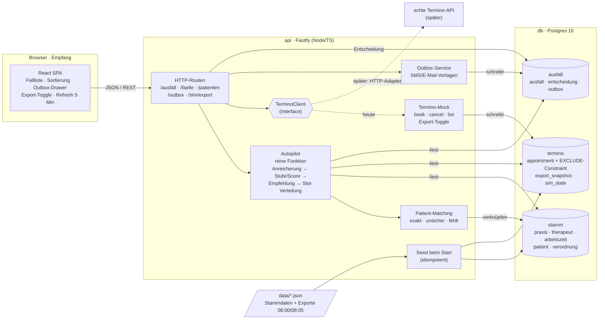
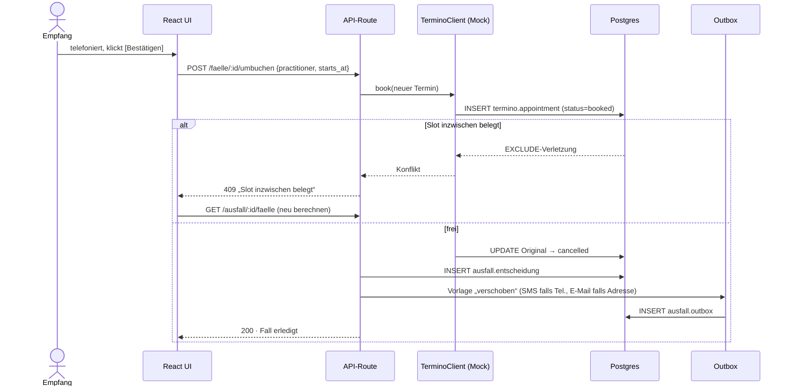

# Design: „Der Ausfall“, ein Autopilot für den Empfang

Stand: 2026-09-30 · Status: zur Freigabe · Kennzeichnung: [F] Fakt aus den Daten, [A] Annahme, [S] Schätzung, [Q] externe Quelle

## 1. Problem und Ziel

**Vorfall [F]:** Mo 07.09.2026, 07:40. Anna Weber (prac_01) meldet sich krank. 14 gebuchte Termine an beiden Standorten, der erste um 08:00.

**Problem:** Der Empfang muss unter Zeitdruck für jeden Termin entscheiden, ob umgebucht, abgesagt oder informiert wird, und wie. Heute sucht er dafür von Hand freie Lücken und prüft Qualifikation, Verordnung und Fristen im Kopf.

**Ziel:** Ein Service mit Oberfläche, der pro betroffenem Termin einen **begründeten, konfliktfreien Vorschlag** liefert und eine **Anrufreihenfolge** vorgibt. Der Empfang telefoniert nur noch und bestätigt, er sucht nicht mehr.

**Erfolgskriterien (Demo):**
- Alle 14 Termine erscheinen mit Priorität, Begründung und Vorschlag. Kein Slot wird doppelt vorgeschlagen.
- Fristen der Verordnung werden erkannt (Cem Öztürk, Renate Vogel) und nie verletzt.
- Datenfehler werden sichtbar gemacht statt still übergangen.
- Bestätigen bucht konfliktfrei (Mock-Termino mit Schutz vor Überschneidung) und erzeugt SMS und E-Mail in einer simulierten Outbox.
- Der Toggle 08:00 ↔ 08:05 zeigt, dass neue externe Buchungen und Stornos die Vorschläge verändern.

## 2. Datenbefunde (per Code geprüft) [F]

| # | Befund | Umgang |
|---|---|---|
| 1 | Alle Zeitstempel in UTC (`06:00Z` = 08:00 in Berlin, Sommerzeit) | Datenbank in UTC, Anzeige in `Europe/Berlin` |
| 2 | Marek Kowalski hat zwei Termine am 07.09. (10:00 Mitte, 16:20 Kreuzberg), Verordnung 1×/Woche, der zweite am 04.09. gebucht | Warnung „Doppelbuchung?“, Vorschlag: späteren Termin nach Rückfrage ersatzlos stornieren |
| 3 | Termino „Katrin Meier“ (pat_02538) heißt in den Stammdaten „Katrin Meyer“, `termino_patient_id = null`. Geburtsdatum und Telefon stimmen | Unscharfer Abgleich → „unsicherer Treffer“, der Empfang bestätigt |
| 4 | Lena Krause (pat_03115) fehlt in den Stammdaten, es gibt keine Verordnung | Warnung „Stammdaten fehlen“, Stufe ⚪ Prüfen |
| 5 | Cem Öztürk: Verordnung 12.08., noch keine Behandlung → Behandlungsbeginn bis spätestens 09.09. Nächster gebuchter Termin erst 10.09. | Stufe 🔴 Frist, niemals „ersatzlos absagen“ |
| 6 | Renate Vogel: letzte Behandlung 26.08. (02.09. storniert) → Unterbrechung darf nicht über den 09.09. hinausgehen | Stufe 🔴 Frist |
| 7 | Gisela Neumann (Jg. 1949) hat keine Telefonnummer, nur E-Mail | Warnung „nicht anrufbar“, nur E-Mail |
| 8 | Die Kalender am 07.09. sind fast voll. Meltem (einzige mit MLD45 in Kreuzberg) hat keine Lücke, in Kreuzberg gibt es kein freies MT. [S] etwa 10 freie Slots für 13 echte Bedarfe | Verteilung der Slots über alle Fälle gemeinsam (siehe 5.3) |
| 9 | Diff 08:00 → 08:05: `apt_004498` storniert (Mi 09.09. 09:20, Sofia, Mitte, KG), `apt_003565` verschoben (Di 08.09., Tobias), `apt_006783` neu (Fr 11.09., Jonas) | Toggle-Demo: der frei gewordene Mi-Slot passt genau für Cem |
| 10 | `prac_03` kommt im Export vor, fehlt aber in `therapeuten.json`. „Lymphdrainage 45 Min.“ ist in Termino mit 40 Min. gebucht. Peter Albrecht (11:40) ist bereits storniert, daher 14 statt 15 Termine | Hinweis in der README, keine Logik |

Fristen [Q]: Behandlungsbeginn innerhalb von 28 Kalendertagen nach Ausstellung. Bei mehr als 14 Kalendertagen Unterbrechung ohne Begründung verliert die Verordnung ihre Gültigkeit. Quellen: https://www.aok.de/gp/heilmittel-richtlinie-vertragszahnaerzte/beginn-und-gueltigkeit-der-verordnung-neu-geregelt, https://heilmittelkatalog.de/aenderungen/heilmittelrichtlinie-01-01-2021/

## 3. Annahmen [A]

1. **Termino hat eine Schreib-API** (buchen und stornieren). Sie ist hier gemockt, der Mock prüft Überschneidungen. Ohne Schreibzugriff würde „Bestätigen“ nur eine Aufgabe anlegen, die der nächste Export bestätigt.
2. **Krankmeldung gilt für heute.** Der Zeitraum ist ein Parameter, verlängern ist möglich (Soll). Annas Slots ab Dienstag sind mögliche Ersatztermine.
3. **„Frontend in React“** ist als React-SPA mit Vite umgesetzt. Im Team wäre die Wahl des Frameworks eine gemeinsame Architekturentscheidung.
4. **Klinische Dringlichkeit** (frisch operiert, Schmerz) steht nicht in den Daten. Harte Regeln sind nur die Fristen der Verordnung und die Frequenz. Die Diagnosegruppe dient ausschließlich als gekennzeichneter Tie-Breaker.
5. **„Jetzt“** ist für die Demo fest auf Mo 07.09.2026 07:40 Berliner Zeit gesetzt (konfigurierbar).
6. **SMS und E-Mail** werden nicht versendet, sondern in einer Outbox-Tabelle erzeugt. Der Link zur Selbstbuchung ist ein Platzhalter.
7. **Ein Notfallkonzept für IT-Ausfälle existiert** (Ausformulierung und Notfallliste optional, siehe 8).
8. Gilt eine Patient:in als „selbst gebucht“, heißt das: neuer gebuchter Termin in Termino nach Anlage der Krankmeldung, nicht von uns angelegt.

## 4. Architektur

```
docker compose up
 ├─ db   Postgres 16
 ├─ api  Node 24 + Fastify (Port 3000), migriert und seedet beim Start idempotent aus data/*.json
 └─ web  Vite + React (Port 5173), Proxy /api → api
```

Monorepo: `api/`, `web/`, `data/` (Rohdaten, unverändert), `docs/`.

### Komponenten



### Ablauf „Bestätigen“ (mit Schutz vor Überschneidung)



**Libraries:** Fastify (schlank, gute TS-Typen), `pg` mit reinem SQL (transparent, ohne Codegenerierung), zod (Validierung), Vitest (Tests), TanStack Query (Refresh und Cache im Frontend), Intl-API für Zeitzonen (keine zusätzliche Library). Die Begründungen stehen in der README.

### 4.1 Datenbank: drei Schemas

| Schema | Tabellen | Wer schreibt |
|---|---|---|
| `stamm` | `praxis`, `therapeut`, `arbeitszeit` (therapeut, wochentag, praxis, von, bis), `patient`, `verordnung` | der Seed. Die App schreibt nur `patient.termino_patient_id` beim Zusammenführen |
| `termino` (Mock) | `appointment` (Felder wie im Export, `starts_at timestamptz`, `ends_at`, `status`, `source` = export/api, Patient als JSON), `export_snapshot` (Rohexporte), `sim_state` (aktiver Export) | nur der `TerminoClient` |
| `ausfall` | `ausfall` (therapeut_id, von, bis, created_at), `entscheidung` (appointment_id, aktion, neuer_termin_id, created_at), `outbox` (kanal, empfänger, betreff, text, appointment_id, created_at) | die App |

**Schutz vor Überschneidung:** `EXCLUDE USING gist (practitioner_id WITH =, tstzrange(starts_at, ends_at) WITH &&) WHERE (status = 'booked')` auf `termino.appointment` (btree_gist). Eine Buchung, die diesen Constraint verletzt, liefert HTTP 409.

**Toggle 08:00 ↔ 08:05:** Das Einspielen eines Snapshots aktualisiert nur Zeilen mit `source='export'`, und zwar Status, Zeit und Neuanlagen. Eigene API-Buchungen bleiben erhalten. Kollidiert eine Zeile mit einer eigenen Buchung, wird sie übersprungen und als Konflikt gemeldet.

### 4.2 TerminoClient (Interface)

`listAppointments(range)`, `book(appointment)`, `cancel(id)`. Heute gibt es die Mock-Implementierung über das Schema `termino`. Später ersetzt ein HTTP-Adapter den Mock.

## 5. Autopilot (reine Funktion, keine Speicherung)

Eingabe: Ausfall, Termine, Stammdaten, Verordnungen, Arbeitszeiten, Entscheidungen, `jetzt`. Ausgabe: je Fall Stufe, Score, Begründungen, Warnungen, Empfehlung, Vorschlag und Alternativen. Der Autopilot wird bei jedem Abruf neu berechnet.

### 5.1 Anreicherung je betroffenem Termin

- **Abgleich der Patient:innen:** `termino_patient_id` → exakt. Sonst gleiches Geburtsdatum und (Telefon oder E-Mail oder Nachname mit Levenshtein ≤ 2) → „unsicher“. Sonst „nicht gefunden“.
- **Heilmittel:** Mapping der Termino-Leistung: Krankengymnastik → KG, Manuelle Therapie → MT, Lymphdrainage 45 Min. → MLD45, Gerätegestützte Krankengymnastik → KGG.
- **Frist:** `min(Ausstellung + 28 T` falls noch keine Behandlung vor dem Termin`, letzte Behandlung + 14 T)`. Behandlung heißt: gebuchter Termin in der Vergangenheit, Stornos zählen nicht.
- **Nächster Termin:** nächster gebuchter Termin der Patient:in nach dem ausgefallenen.
- **Doppelbuchung:** ein weiterer gebuchter Termin derselben Patient:in am selben Tag.

### 5.2 Stufe, Score, Empfehlung

| Stufe | Regel |
|---|---|
| 🔴 Frist | Frist ≤ jetzt + 3 Tage |
| 🟠 Hoch | Frequenz 2×/Woche, oder [A] Diagnosegruppe EX3/LY2 (Tie-Breaker, gekennzeichnet) |
| 🟢 Normal | alle übrigen mit Verordnung |
| ⚪ Prüfen | Doppelbuchung (der spätere Termin), Stammdaten fehlen |

**Score (0–100)** zur Sortierung innerhalb einer Stufe: weniger Tage bis zur Frist, höhere Frequenz, mehr Tage seit der letzten Behandlung. Die Begründungen erscheinen als Chips.

**Empfehlung:**
- `ersatzlos_absagen`: Der nächste gebuchte Termin liegt höchstens `ABSAGE_TAGE = 2` Tage entfernt **und** nicht nach der Frist (Beispiel: Jan Ahrens → Mi 09.09.). Verbraucht keinen Slot.
- `doppelbuchung_stornieren`: der spätere von zwei Terminen am selben Tag. Verbraucht keinen Slot.
- `umbuchen`: Standardfall, bekommt einen Slot über 5.3.
- `absagen_mit_link`: 🟢 ohne Slot am selben Tag → markiert als „absagbar“, Link zur Selbstbuchung.
- `eskalieren`: kein Slot vor der Frist → „Standortleitung: Vertretung anfragen (z. B. Clara Petersen, Mo frei)“.

**Unsichere Daten:**
- Ein „unsicherer Treffer“ wird mit Verordnung wie ein Treffer behandelt. Er trägt die Warnung „Identität prüfen“ und bietet den Button **[Zusammenführen]**. Der schreibt die `termino_patient_id` in den Stammdatensatz. Danach ist der Treffer exakt, und die Warnung verschwindet beim nächsten Abruf.
- „Stammdaten fehlen“ wird deutlich als Warnung angezeigt, bekommt `umbuchen` ohne Frist und wird in der Verteilung zuletzt bedient.

### 5.3 Verteilung der Slots

1. **Mögliche Slots:** Therapeut:innen außer den ausgefallenen im Ausfallzeitraum, mit passender Qualifikation, innerhalb der Arbeitszeit und Praxis laut `arbeitszeit`, Raster 20 Minuten ab Beginn des Arbeitsblocks, Dauer wie im Original, keine Überschneidung mit gebuchten Terminen. Zeitraum: frühestens `jetzt + 20 Min`, spätestens `min(Frist, Ende des Exportfensters 13.09.)`. Ausgeschlossen sind Tage, an denen die Patient:in schon einen gebuchten Termin hat.
2. **Rang der Slots:** ① gleiche Startzeit und gleiche Praxis (Badge „✓ gleiche Uhrzeit“) → ② gleicher Tag, gleiche Praxis → ③ gleicher Tag, andere Praxis → ④ Folgetage, der früheste zuerst, gleiche Praxis bevorzugt.
3. **Greedy:** Die Fälle mit Empfehlung `umbuchen` werden nach (Stufe, Score, Uhrzeit) sortiert. Jeder reserviert seinen besten freien Slot. Vorschlag plus bis zu 2 Alternativen, die noch nicht reserviert sind. Deterministisch.

### 5.4 Zwei Reihenfolgen

- **Verteilung der Slots:** nach Priorität (5.3).
- **Anzeige „Autopilot“ = Anrufreihenfolge:** offene Fälle mit Start in weniger als 60 Min zuerst, dann nach Stufe und Score. Alternative Sortierung: nach Uhrzeit. Erledigte Fälle stehen unten und sind ausgegraut.

## 6. API

| Methode und Pfad | Zweck |
|---|---|
| `POST /api/ausfall` `{therapeut_id, von, bis}` | Krankmeldung anlegen. Beim Seed ist Anna Weber am 07.09. bereits angelegt |
| `PATCH /api/ausfall/:id` `{bis}` | verlängern (Soll) |
| `GET /api/ausfall/:id/faelle` | Ergebnis des Autopiloten |
| `GET /api/faelle/:appointmentId/slots` | alle freien, passenden Slots |
| `POST /api/faelle/:appointmentId/umbuchen` `{practitioner_id, starts_at}` | buchen und Original stornieren, danach Outbox. 409 bei Konflikt |
| `POST /api/faelle/:appointmentId/absagen` `{mit_link}` | stornieren, danach Outbox |
| `POST /api/patienten/:patientId/verknuepfen` `{termino_patient_id}` | unsicheren Treffer zusammenführen. 409, wenn die Termino-ID schon verknüpft ist |
| `GET /api/outbox` | simulierte Nachrichten |
| `GET /api/sim/export`, `POST /api/sim/export` `{export: "0800" \| "0805"}` | Toggle |

Outbox: SMS nur, wenn eine Telefonnummer vorhanden ist. E-Mail nur, wenn eine Adresse vorhanden ist. Deutsche Textvorlagen: verschoben, abgesagt mit Link, Storno der Doppelbuchung.

## 7. UI (eine Seite für den Empfang)

- **Kopfzeile:** Ausfall (Name, Datum), Zähler offen/erledigt, Countdown „nächstes Update in m:ss“ (Soll), Button „jetzt aktualisieren“, Toggle für den Export.
- **Sortierung:** Autopilot-Anrufreihenfolge | Uhrzeit.
- **Fallkarte:** Rand in der Farbe der Stufe, Uhrzeit, Praxis, Leistung, Name, Telefon und E-Mail, „in X Min“. Chips mit Begründungen und Warnungen. Bei einem unsicheren Treffer: Gegenüberstellung Termino ↔ Stammdaten (Name, Geburtsdatum, Telefon, E-Mail) und [Zusammenführen]. „Stammdaten fehlen“ als rote Warnung. Vorschlag mit Badge. Buttons [Bestätigen] [Anderer Slot ▾] [Absagen ▾]. Bei einem 409 erscheint der Hinweis „Slot inzwischen belegt“ und die Karte lädt neu.
- **Outbox-Drawer:** Vorschau der erzeugten SMS und E-Mails.

## 8. Umfang

**Muss:** Stammdaten, Seed und Mock-Termino mit Constraint und Toggle. Autopilot (5.1–5.4). API aus 6 ohne PATCH. UI aus 7 ohne Countdown. README, ARCHITECTURE.md, CLAUDE.md.

**Soll (wenn Zeit bleibt), in dieser Reihenfolge:**
1. Countdown und automatischer Refresh (5 Min)
2. Krankmeldung verlängern (PATCH und UI)
3. Button „Simuliere: Patient:in bucht selbst“
4. `data/diagnosegruppen.json` mit Quelle, Klartext in den Chips
5. Notfallliste (Seite zum Drucken) und Ausformulierung des IT-Notfallkonzepts in der README

**Bewusst weggelassen:** echte Seite zur Selbstbuchung, echter Versand, Warteliste und Nachbelegung von Annas Slots, Auth, Mandantenfähigkeit im Code (nur ARCHITECTURE.md), vollständige Fehlerbehandlung.

**Nächste Schritte (README):** Playwright-E2E-Tests, Anbindung an die echte Termino-API, Nachbelegung aus der Warteliste, Opt-in und Kanalpräferenz der Patient:innen, Kennzahlen (Zeit bis alle informiert sind, Anteil erfolgreich umgebucht).

## 9. Tests

- **Vitest (TDD) für den Autopiloten** mit Fixtures aus den echten Daten:
  - Fristen von Cem und Renate = 09.09.
  - Cem nie `ersatzlos_absagen`, Jan `ersatzlos_absagen`
  - Doppelbuchung von Marek erkannt
  - kein Slot doppelt vergeben
  - Qualifikation: MLD45 nur Meltem oder Anna, MT nie bei Sofia, David oder Tobias
  - Umrechnung UTC → Berlin
- **Abgleich der Patient:innen:** Meier → unsicher, nach dem Zusammenführen → exakt. Lena → nicht gefunden.
- **Integration (echtes Postgres):** Eine Buchung mit Überschneidung liefert 409.
- **Smoke-Test vor jedem Merge:** `docker compose up` → UI zeigt 14 Fälle → einmal Bestätigen → einmal Toggle.

## 10. Arbeitsablauf

- Branches: `main` ← `develop` ← `feature/*`.
- **Grundsetup** (Monorepo, Compose, Schema, Seed, Grundgerüst von API und Web) direkt auf `develop`.
- Danach **ein Worktree pro lose gekoppeltem Feature** unter `.worktrees/<name>` (in `.gitignore`): `termino-mock`, `autopilot`, `api`, `ui`, `docs`, danach die Soll-Features.
- Vor jedem Merge: Tests grün, kurzes Review des Diffs, `git merge --no-ff` nach `develop`. Am Ende `develop` → `main`. Kein Push ohne Freigabe.

## 11. ARCHITECTURE.md: Eckpfeiler (100+ Praxen, mandantenfähig)

1. **Mandantenmodell:** gemeinsame Datenbank, `tenant_id` in jeder Tabelle, Postgres Row-Level-Security. Große Partner optional mit eigener Datenbank (Silo).
2. **Integrationsschicht:** ein Adapter pro Buchungs- und Praxissoftware hinter `BookingClient`. Webhook oder Polling → Inbox, Idempotenz, Outbox-Pattern für Schreibzugriffe.
3. **Autopilot als zustandsloser Domänenservice.** Die Regeln (Fristen, Schwellen, Gewichte) sind pro Mandant konfigurierbar und versioniert.
4. **Benachrichtigungen als eigener Service** mit Queue, Vorlagen pro Mandant, Kanalpräferenz und Opt-in.
5. **DSGVO und Gesundheitsdaten:** Hosting in der EU, Verschlüsselung at rest und in transit, Audit-Log, Rollen pro Standort, Löschkonzept.
6. **Betrieb:** Observability pro Mandant, Feature-Flags für schrittweises Ausrollen, Pilot an einem Standort, IT-Notfallkonzept (Notfallliste offline).
